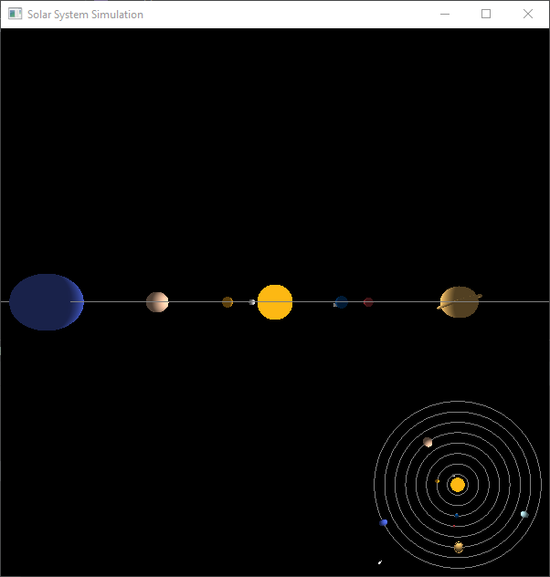
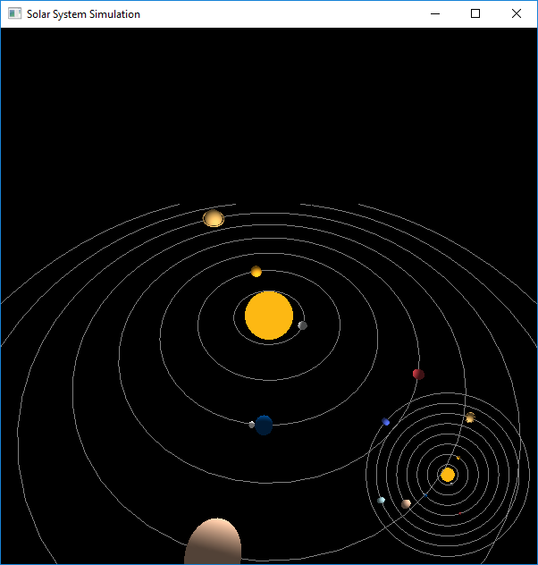
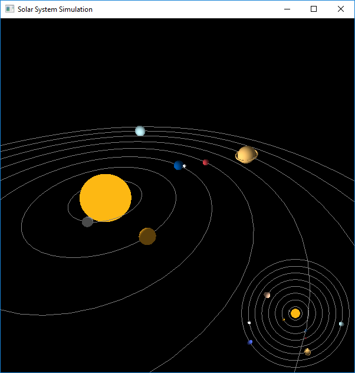
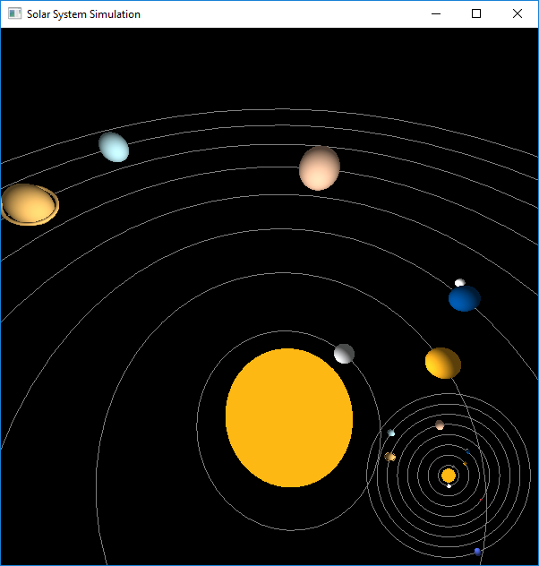
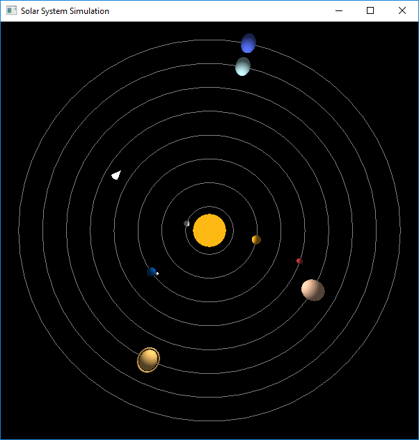

# Solar System Simulation

This is a solar system simulation program written in C++ using the OpenGL library. The program allows you to explore a virtual solar system and control a spacecraft within it.

## Features

- Simulates the motion of celestial bodies in the solar system.
- Control the spacecraft's movement and orientation.
- View the solar system from different perspectives.

## Prerequisites

To run this program, you need to have the following installed:

- C++ compiler
- OpenGL library

## Installation

1. Clone the repository:

   ```
   git clone https://github.com/Marwan-Mahmoud/Solar-System-Simulation.git
   ```

2. Compile the program using your preferred C++ compiler:

   ```
   g++ main.cpp -o solar-system -lglew32 -lopengl32 -lfreeglut -lglu32
   ```

3. Run the executable:

   ```
   ./solar-system
   ```

## Usage

- Use the arrow keys to rotate the spacecraft.
- Press 'w' to move the spacecraft forward and 's' to move backward.
- Press 'm' to toggle between the main view and the map view.

## Screenshots






